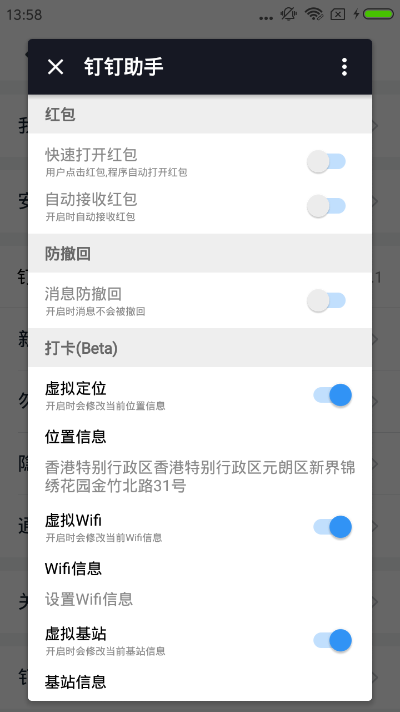

手机如何远程钉钉打卡

由于最近公司开始使用钉钉打卡了，最近准备离职了，所以事件就比较少，网上找了一下如何使用远程打卡，分享一下。

### 需要找一个平时不用，可以root的手机

拿小米手机来说，刷成开发版，自己网上百度

1.安装 ：[太极APK](https://www.taichi-app.com/#/index)

2.安装钉钉打卡助（注意版本号钉钉助手里面有提示对应的钉钉版本号）
[钉钉助手](https://github.com/search?utf8=%E2%9C%93&q=%E9%92%89%E9%92%89%E5%8A%A9%E6%89%8B&type=)

3.通过太极创建应用，选择钉钉，创建成功后

4.进入钉钉 设置里面有个钉钉助手

